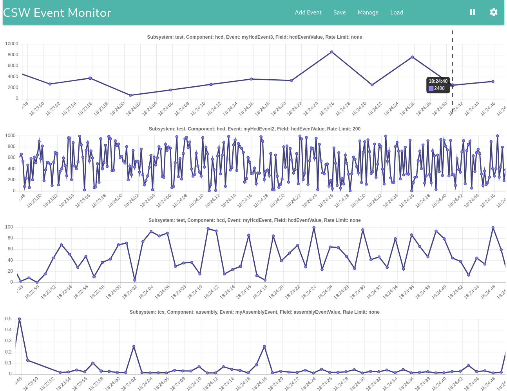

# CSW Event Monitor

The CSW Event Monitor is an akka-http/scala.js based web app for monitoring numeric values in CSW events. The app lets you subscribe to CSW events and then displays a stripchart for each event selection.

Controls are provided for pausing the display, changing the size of the charts and the amount of time displayed.

To build, run: 
    
    sbt stage

The app has a dedicated HTTP server. Run:
 
    ./target/universal/stage/bin/csw-event-monitor-server

to start it and then go to http://localhost:9090

In order to have some events to plot, you will need to have some CSW components running. For test purposes, you can run the HCD and assembly from the [csw-prod-qa](https://github.com/tmtsoftware/csw-prod-qa) project. It publishes dummy events with random values using the tcs and test subsystems.

For example: Start csw-services.sh:

    csw-services.sh start

Then from the csw-prod-qa top level directory:

    test-hcd-app --local frameworkTests/src/main/resources/TestHcd.conf

and in another window:

    test-assembly-app --local frameworkTests/src/main/resources/TestAssembly.conf

Note that some events are published at a high rate. In order to plot them, it is best to either select `Rate Limit` before subscribing, or use the settings dialog to change the `duration` and `ttl` values to be only a few seconds.

Once the HCD and assembly are running, you can click on `Add Event` and select the `test` or `tcs` subsystem. After a short delay, the component and event name menus should be populated with the available values.

